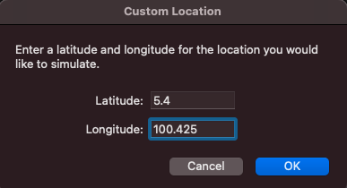

How to set coordinates:
On iOS simulator menu select Features > Location to get the following window:

The following demonstrations are tested on an iOS simulator with iOS version 14.4.
The project currently only works on iOS as it was initially built using iOS simulator.

Follow the demo images to test geofencing features. Interchange your coordinates outside and inside the zone will trigger the notification pop up as well as update the zone status in the app. The feature works even when the app is closed. You can set your own geofence region within the app or use the preset locations listed below.

Requirements

	• Setup Geofencing area
	• Detect geofencing status based on wifi network and geographic point
	• Display status on app for inside or outside geofence area
	• Host source code privately on GitHub
	• Create readme with instructions
	• Grant access to engineering@setel.my

Flutter packages

	• wifi_info_flutter (getWifiName/getWifiSSID)
	• flutter_geofence
	• Geolocator (foreground location and calculate distance)
	• Flutter_local_notifications (notifying user of geofencing)
	• Google_maps_flutter (Display user location)
	• Provider (State management)
	• Sliding_up_panel (Add geofence form)
	• Permission_handler (Used to get wifi location permission)
	• Shared_preferences (Local device storage)
	
ToDos 
Main function: 

	• Create geofence streams to listen to the current user location and triggers an alert whenever user is in targeted vicinities (500m) 
	• UI should display if the user is inside or outside the vicinities 
	• Set a few locations (petronas stations) to be targeted vicinities 
	• If user is connected to the vicinity wifi then consider the user to be inside the zone 
	• Ensure that alert still triggers when app is not running 
	• Add custom geofence region

Additional functions: 

	• Display Google map in app UI  
	• Mark user location in realtime 
	• Create unit tests 

Preset Locations: 
 
<b>Petronas Ara Damansara</b>
 
Coordinates - lat 3.1234, long 101.5755

<b>Petronas Alam Sutera</b>
 
Coordinates - lat 3.052591, long 101.6527169

<b>Petronas Axis shah alam</b>
 
Coordinates - lat 3.0270851, long 101.5420121

<b>Petronas Bandar Baru Salak Tinggi</b>
 
Coordinates - lat 2.806143, long 101.7163006

